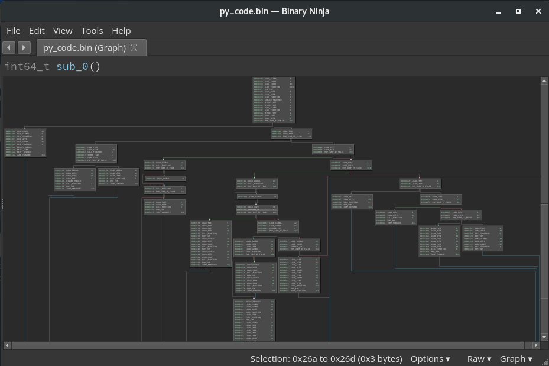
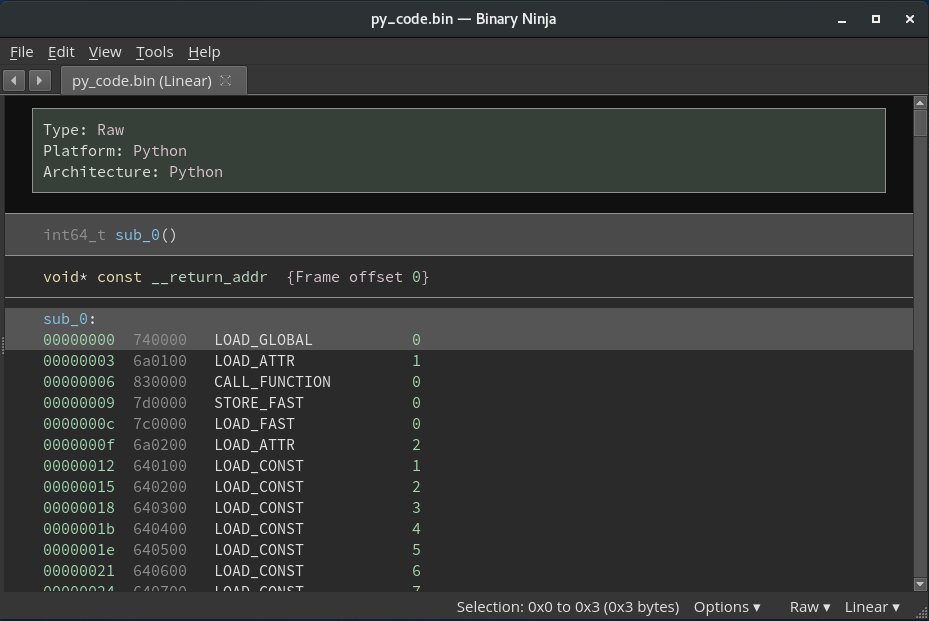

# bnpy

A binary ninja architecture plugin to disassemble raw python bytecode.

## Installation

Clone the repo to the Binary ninja plugins directory.

```sh
$ git clone https://github.com/extremecoders-re/bnpy.git
```

## Usage

Lets say we have a file example.pyc. The first step is to extract raw instruction stream to a file

```python
import marshal

# Open the pyc file
pyc_file = open('example.pyc', 'rb')

# Skip magic and timestamp
pyc_file.seek(8)

# Unmarshal
code_object = marshal.load(pyc_file)
code_string = code_object.co_code

# Dump to file
open('py_code.bin', 'wb').write(code_string)
```

The produced file then be loaded in Binary Ninja. Press `P` to select the architecure as Python.

This way you can disassemble the root code object. A pyc file however may contain multiple nested code objects embedded in  `co_consts`. To dump all of them you can use the following recursive approach.

```python
import marshal
import types

file_num = 0

def parse(code_object):
	global file_num
	open('py_code_' + str(file_num) + '.bin', 'wb').write(code_object.co_code)
	file_num += 1

	for const in code_object:
		if instanceof(const, types.CodeType):
			parse(code_object)

# Open the pyc file
pyc_file = open('example.pyc', 'rb')

# Skip magic and timestamp
pyc_file.seek(8)

# Unmarshal
code_object = marshal.load(pyc_file)
parse(code_object)
```

## TODO

- Implement a full fledged BinaryView to support disassembling of pyc files. Currently, this is difficult to do due to limitations in the Binary Ninja API (See issues [#133][1], [#551][2], [#728][3])
- IL of bytecode instructions
- Inline `co_consts`, `co_names` within the disassembly rather than referring them by indices

[1]: https://github.com/Vector35/binaryninja-api/issues/133
[2]: https://github.com/Vector35/binaryninja-api/issues/551
[3]: https://github.com/Vector35/binaryninja-api/issues/728

## Screenshot


### Graph view



### Linear view




## License

The MIT License